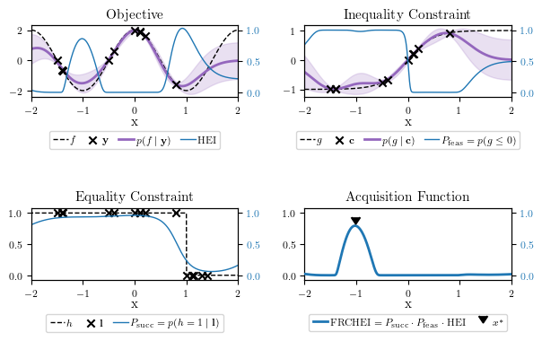

# CBOSS - Combinatorial Bayesian Optimization for Structure Selection

This repository is part of the submission at the Transactions in Machine Learning Research (TMLR) journal:

[Discovering Model Structure of Dynamical Systems with Combinatorial Bayesian Optimization](https://openreview.net/forum?id=2iOOvQmJBK)

This repository contains the code for the CBOSS optimizer and the experiments presented in the paper.
The main optimizer function can be found at [optimizers/CBOSS.py](optimizers/CBOSS.py).


## Optimization Problem

**CBOSS** is a **Bayesian Optimization** method used to solve **combinatorial optimization problems subject to inequality and crash constraints**:

$$
\begin{align}
    \boldsymbol x^* = \arg\min_{\boldsymbol x\in\mathcal X} & \quad f (\boldsymbol x) 
    \\
    s.t. & \quad g_j(\boldsymbol x) \leq 0 \quad  \forall j \in \{1, \dots, M\} \\
         & \quad h(\boldsymbol x) = 1
\end{align}
$$

where 
- $x$ is a vector of categorical decision variables denoted as $\boldsymbol x \in \mathcal X$, defined over the combinatorial domain $\mathcal X = \mathcal X_1 \times \mathcal X_2 \times\dots \times \mathcal X_d$ with $d$ categorical decision variables with respective cardinalities $k_1, \dots, k_d$.
- $f: \mathcal X \to \mathbb R$ is the objective function.
- $g_j: \mathcal X \to \mathbb R$ are the inequality constraints.
- $h: \mathcal X \to \{0,1\}$ are the binary equality constraints indicating evaluation "crashes".


The functions $f$, $\boldsymbol g$, and $h$ are all expensive-to-evaluate black-box functions and can only be obtained simultaneously. The functions $f$ and $\boldsymbol g$ are noisy and can only be assessed when the experiment is successful, i.e.

$$
\begin{align}
    (y, \boldsymbol c, l) = \left\{
    \begin{array}{llll}
            (f(\boldsymbol x) + \epsilon_y, & \boldsymbol g(\boldsymbol x) + \boldsymbol\epsilon_c, & 1) & \text{if } \boldsymbol x \text{ is evaluation success} \\
            (\varnothing, & \varnothing & 0) & \text{if } \boldsymbol x \text{ is evaluation failure}
    \end{array}
    \right.
\end{align}
$$

where the noise $\epsilon_y \sim \mathcal{N}(0, \sigma_y^2)$ and $\boldsymbol \epsilon_c \sim \mathcal{N}(0, \text{diag}(\boldsymbol\sigma_{c}^2))$
are i.i.d. and normally distributed.


## Acquisition function

It implements surrogate models designed for combinatorial spaces and the acquisition function `FRCHEI` that can handle inequality and crash constraints.



*(generated with `notebooks/FRCHEI.ipynb`)


Note that although we consider only categorical variables, this optimizer can be adapted for continuous or mixed inputs spaces.

## Benchmark Problems

See [github.com/lucasrm25/Model-Structure-Selection-CBOSS](https://github.com/lucasrm25/Model-Structure-Selection-CBOSS) for the specification of the benchmark problems.


## Installation

To install the package, activate your python environment and run:

```sh
make build
make install
```

## Unit Tests

Python unit tests available at [test/](test) can be run with:
```sh
make test
```


## License

This project is licensed under the terms of the MIT license. See [LICENSE](LICENSE) for more details.

## Citation

If you use this code in your research, please cite the following paper:

```bibtex
@article{
    anonymous2023discovering,
    title={Discovering Model Structure of Dynamical Systems with Combinatorial Bayesian Optimization},
    author={Anonymous},
    journal={Submitted to Transactions on Machine Learning Research},
    year={2023},
    url={https://openreview.net/forum?id=2iOOvQmJBK},
    note={Under review}
}
```